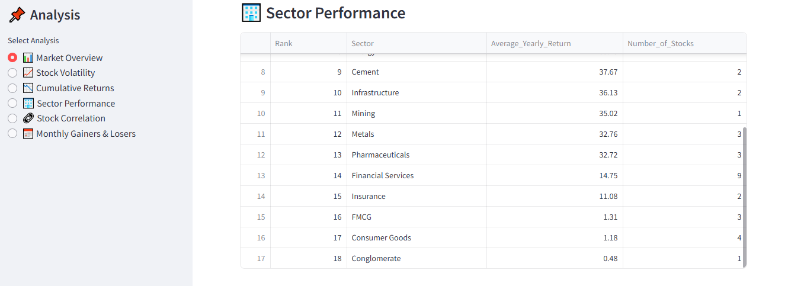
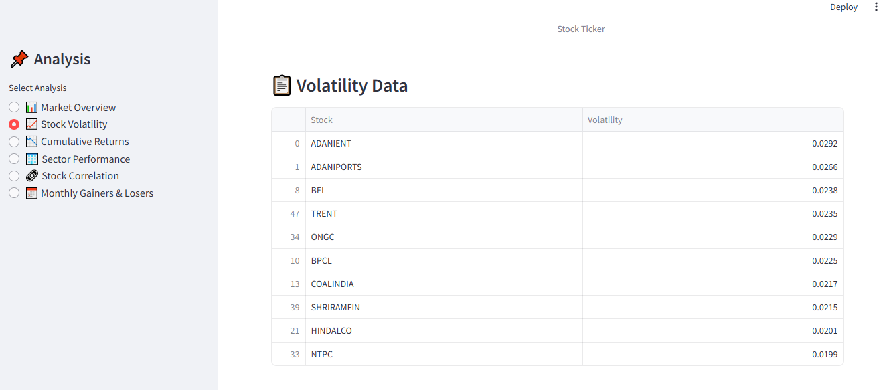
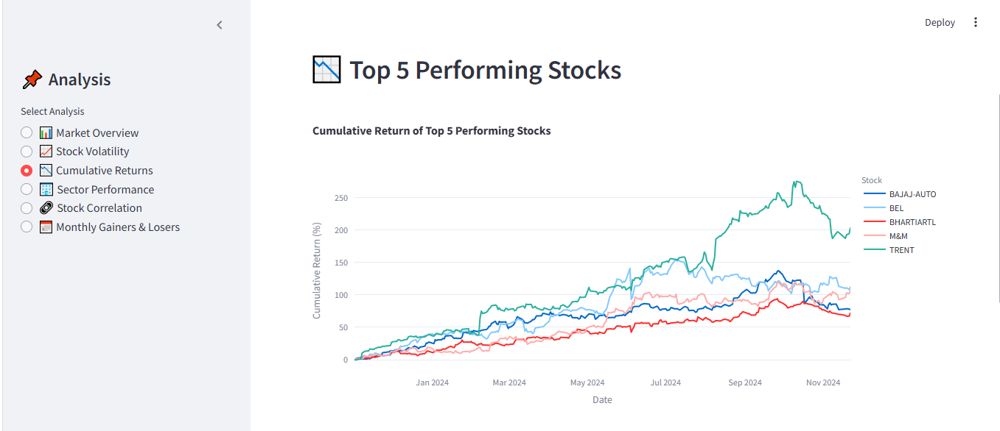
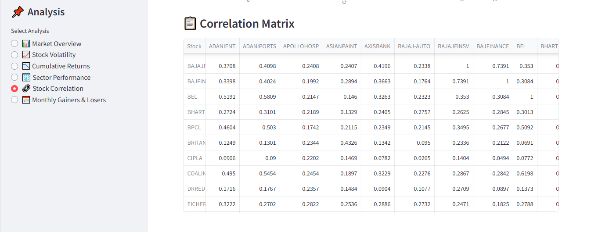
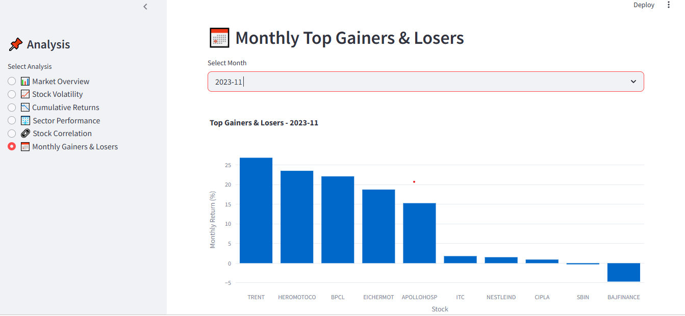
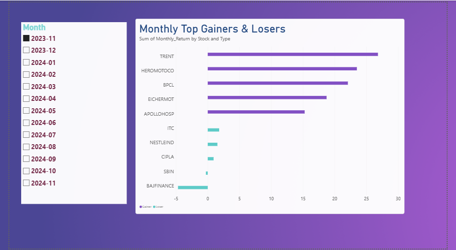
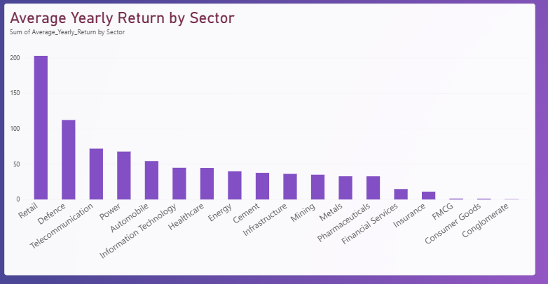
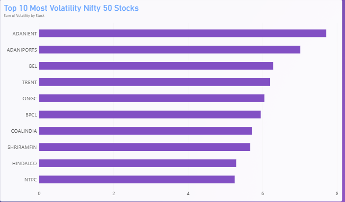

# Data-Driven Stock Analysis

## Organizing, Cleaning, and Visualizing Market Trends

---

## 📌 Project Overview

**Data-Driven Stock Analysis** is a data analytics project focused on analyzing historical NIFTY 50 stock market data from November 2023 to November 2024.

The project uses Python, Pandas, SQL, Streamlit, and Power BI to extract, clean, transform, analyze, and visualize stock market data.

The project provides insights into:

- Stock returns
- Market performance
- Stock volatility
- Cumulative returns
- Sector-wise performance
- Stock correlations
- Monthly gainers and losers

Two dashboards are developed as part of this project:

- **Streamlit Dashboard** – Python-based interactive dashboard
- **Power BI Dashboard** – Interactive business intelligence dashboard

---

## 🎯 Objectives

- Analyze historical NIFTY 50 stock market data.
- Extract and clean raw YAML data.
- Convert YAML data into structured CSV datasets.
- Store processed stock data in a MySQL database.
- Identify the top 10 performing and underperforming stocks.
- Calculate market summary statistics.
- Analyze stock volatility and cumulative returns.
- Analyze sector-wise performance.
- Calculate stock price correlations.
- Identify monthly top gainers and losers.
- Develop interactive dashboards using Streamlit and Power BI.

---

## 🛠️ Technologies Used

| Category | Technologies |
|---|---|
| Programming | Python |
| Data Analysis | Pandas, NumPy |
| Visualization | Matplotlib, Seaborn |
| Machine Learning | Scikit-learn |
| Data Extraction | PyYAML |
| Database | MySQL |
| Database Connectivity | SQLAlchemy, PyMySQL |
| Dashboard | Streamlit, Power BI |
| Version Control | Git, GitHub |

---

## 📂 Dataset

The project uses historical market data for **50 NIFTY 50 stocks**.

**Data Period:** November 2023 to November 2024

### Data Fields

- Date
- Ticker
- Open
- High
- Low
- Close
- Volume
- Month

The dataset is used to calculate stock returns, volatility, cumulative performance, monthly returns, and sector-wise performance.

---

## 🔄 Project Workflow

```text
Raw YAML Data
      |
      v
Data Extraction
      |
      v
Data Cleaning and Transformation
      |
      v
CSV Datasets
      |
      v
MySQL Database
      |
      v
Data Analysis
      |
      +-----------------------+
      |                       |
      v                       v
Streamlit Dashboard      Power BI Dashboard
      |                       |
      v                       v
Interactive Analysis     Business Intelligence

📊 Key Analysis
1. Top 10 Gainers

Identifies the top 10 NIFTY 50 stocks based on yearly returns.

2. Top 10 Losers

Identifies the 10 stocks with the lowest yearly returns.

3. Market Summary

Provides an overview of market performance using:

Total number of stocks
Number of green stocks
Number of red stocks
Average closing price
Average trading volume
4. Volatility Analysis

Calculates daily returns and standard deviation to identify stocks with higher price fluctuations.

Daily return is calculated using:

Daily Return = (Current Close - Previous Close) / Previous Close
5. Cumulative Returns

Calculates cumulative returns to analyze stock performance over time and identify top-performing stocks.

6. Sector-wise Performance

Maps NIFTY 50 stocks to their respective sectors and calculates average yearly returns for each sector.

7. Stock Correlation

Calculates correlations between stock prices using Pandas and visualizes the relationships through a correlation heatmap.

8. Monthly Gainers and Losers

Identifies the top 5 gainers and top 5 losers for each month during the analysis period.

## 📊 Dashboard Previews

### 1. Streamlit Dashboard

Interactive NIFTY 50 Stock Analysis dashboard built using Python, Pandas, MySQL, and Streamlit.

#### 🏠 Market Overview




#### 📉 Stock Volatility




#### 📈 Cumulative Returns




#### 🏢 Sector Performance


#### 🔗 Stock Correlation




#### 📅 Monthly Gainers and Losers




---

### 2. Power BI Dashboard

Interactive Power BI reports for stock returns, volatility, sector performance, monthly gainers and losers, and stock correlations.

#### 📅 Monthly Gainers and Losers



#### 🏢 Sector Performance



#### 📉 Stock Volatility



#### 📈 Cumulative Returns


#### 🔗 Stock Correlation


---

### 🚀 Run the Streamlit Dashboard

1. Clone the repository:

   ```bash
   git clone https://github.com/arthi-564219/Data-Driven-Stock-Analysis.git
   ```

2. Open the project folder:

   ```bash
   cd Data-Driven-Stock-Analysis
   ```

3. Install the required packages:

   ```bash
   python -m pip install -r requirements.txt
   ```

4. Start the Streamlit application:

   ```bash
   python -m streamlit run app.py
   ```

5. Open the local URL displayed in the terminal, usually `http://localhost:8501`.

**Note:** MySQL must be installed and configured for the database-connected features to work.

---

### 🔗 Project Links

- **GitHub Repository:** https://github.com/arthi-564219/Data-Driven-Stock-Analysis
- **Streamlit Dashboard:** Run locally using the instructions above.
- **Power BI Dashboard:** View the screenshots in the repository's `powerbi_dashboard.png` folder. The interactive `.pbix` file can be added if you decide to publish or share it.

📁 Project Structure
Data-Driven-Stock-Analysis/
│
├── app.py
├── query
├── .gitignore
├── README.md
├── requirements.txt
│
├── data/
│   └── csv_files/
│       ├── nifty_50/
│       ├── monthly_charts/
│       ├── market_summary.csv
│       ├── monthly_gainers_losers.csv
│       ├── sector_performance.csv
│       ├── stock_correlation.csv
│       ├── stock_return.csv
│       ├── stock_returns.csv
│       ├── stock_sectors.csv
│       ├── stock_summary.csv
│       ├── stock_volatility.csv
│       ├── top_10_gainers.csv
│       ├── top_10_losers.csv
│       ├── top_10_volatility.csv
│       └── top_5_cumulative_returns.csv
│
├── powerbi_dashboard.png/
│   ├── cumulative_returns.png
│   ├── monthly_gainers_losers.png
│   ├── sector_performance.png
│   ├── stock_correlation.png
│   └── stock_volatility.png
│
├── streamlit_dashboard/
│   ├── streamlit_cumulative_returns_chart.png
│   ├── streamlit_cumulative_returns_table.png
│   ├── streamlit_dashboard.png
│   ├── streamlit_market_overview_monthly_data.png
│   ├── streamlit_market_overview_sector_table.png
│   ├── streamlit_monthly_data.png
│   ├── streamlit_monthly_gainers_losers_chart.png
│   ├── streamlit_sector_performance_chart.png
│   ├── streamlit_sector_performance_table.png
│   ├── streamlit_stock_correlation_heatmap.png
│   ├── streamlit_stock_correlation_matrix.png
│   ├── streamlit_volatility_chart.png
│   └── streamlit_volatility_table.png
│
├── scripts/
│   ├── 01_read_companies.py
│   ├── 01_yaml_to_csv.py
│   ├── 02_read_csv.py
│   ├── 02_store_to_sql.py
│   ├── 03_calculate_returns.py
│   ├── 03_market_analytics.py
│   ├── 04_moving_average.py
│   ├── 05_volatility.py
│   ├── 06_stock_summary.py
│   ├── 07_read_nifty.py
│   ├── 07_top_stocks.py
│   ├── 08_top_gainers_losers.py
│   ├── 09_market_summary.py
│   ├── 10_top_volatility.py
│   ├── 11_cumulative_return.py
│   ├── 12_sector_performance.py
│   ├── 13_stock_correlation.py
│   ├── 14_market_visualization.py
│   ├── 15_monthly_gainers_losers.py
│   ├── 16_monthly_gainers_losers_visualization.py
│   ├── 16_split_by_symbol.py
│   ├── 17_volatility_standard.py
│   └── 18_stock_return.py
│
└── yaml_files/
    └── Monthly stock data
🗄️ Database

The processed stock market data is stored in MySQL.

Component	Details
Database	stock_analysis
Main Table	stocks
Database Connectivity	SQLAlchemy, PyMySQL

SQL is used to store, query, and retrieve processed stock market data for analysis and dashboard development.

⚙️ Installation

Install Python and the required libraries.

pip install pandas numpy matplotlib seaborn scikit-learn pyyaml streamlit sqlalchemy pymysql

Alternatively, install all project dependencies using:

pip install -r requirements.txt

Make sure MySQL is installed and configured if you want to use the database functionality.

▶️ Running the Project
Step 1: Clone the Repository
git clone https://github.com/arthi-564219/Data-Driven-Stock-Analysis.git
Step 2: Navigate to the Project Directory
cd Data-Driven-Stock-Analysis
Step 3: Install Dependencies
pip install -r requirements.txt
Step 4: Run the Streamlit Application
streamlit run app.py

The Streamlit application will open in your browser.

📦 Key Project Outputs

The project generates datasets and visualizations for:

Top 10 Gainers
Top 10 Losers
Market Summary
Top 10 Volatility
Cumulative Returns
Sector Performance
Stock Correlation
Monthly Gainers and Losers
Stock Returns
Stock Volatility
📋 Project Results

The following results summarize the market analysis for the selected dataset and analysis period.

Market Summary
Metric	Result
Total Stocks	50
Green Stocks	38
Red Stocks	12
Green Stocks Percentage	76%
Red Stocks Percentage	24%
Average Closing Price	2230.16
Average Trading Volume	7,250,021.43
Top Gainers

The top-performing stocks based on yearly returns include:

Rank	Stock	Yearly Return
1	ADANIPORTS	50.42%
2	BPCL	41.67%
3	ONGC	40.40%
4	TRENT	36.84%
5	ADANIENT	34.11%
Top Volatile Stocks

The volatility analysis identifies stocks with higher variation in daily returns.

Rank	Stock	Volatility
1	BPCL	8.64%
2	ONGC	7.51%
3	ADANIPORTS	6.04%
4	TRENT	5.75%
5	COALINDIA	5.27%
💼 Business Use Cases
1. Stock Performance Ranking

Identify the top-performing and underperforming NIFTY 50 stocks based on yearly returns.

2. Market Overview

Understand overall market performance using green and red stock counts, average prices, and average trading volume.

3. Investment Insights

Identify stocks with strong growth, significant declines, and higher volatility for further analysis.

4. Decision Support

Provide data-driven insights into stock performance, volatility, sector trends, and correlations.

🎓 Skills Demonstrated
Data Collection and Extraction
Data Cleaning and Transformation
Exploratory Data Analysis
Statistical Analysis
Financial Data Analysis
Data Visualization
SQL Database Management
Python Programming
Dashboard Development
Streamlit
Power BI
Git and GitHub
📌 Project Deliverables
Cleaned and processed stock market datasets
Python analysis scripts
MySQL database
Streamlit interactive dashboard
Power BI dashboard
Project documentation
GitHub repository
💻 Coding Standards
Python code follows PEP 8 guidelines.
Modular Python scripts are used for different analysis tasks.
Data processing and visualization steps are organized into separate scripts.
Git and GitHub are used for version control and project maintenance.
👤 Author

Aarthi R

B.Sc. Computer Science

GitHub: Data-Driven-Stock-Analysis

⚠️ Disclaimer

This project is developed for educational and data analytics purposes. The analysis is based on historical stock market data and should not be considered financial or investment advice.
