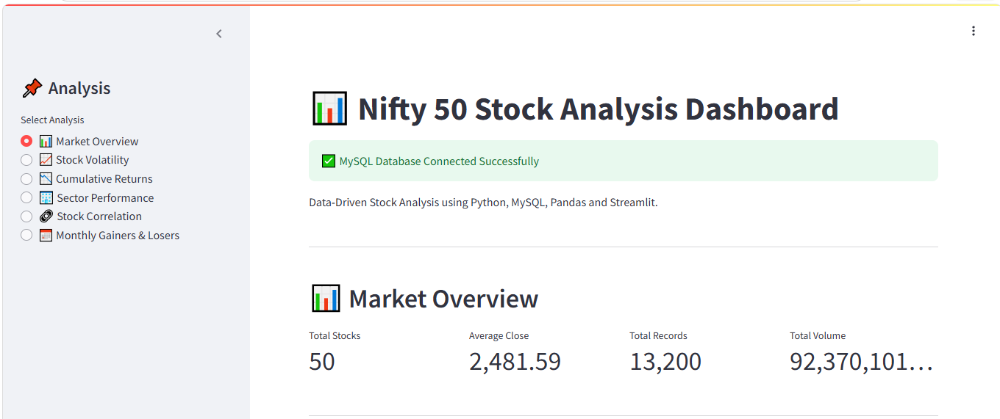
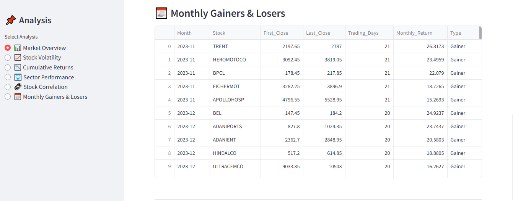
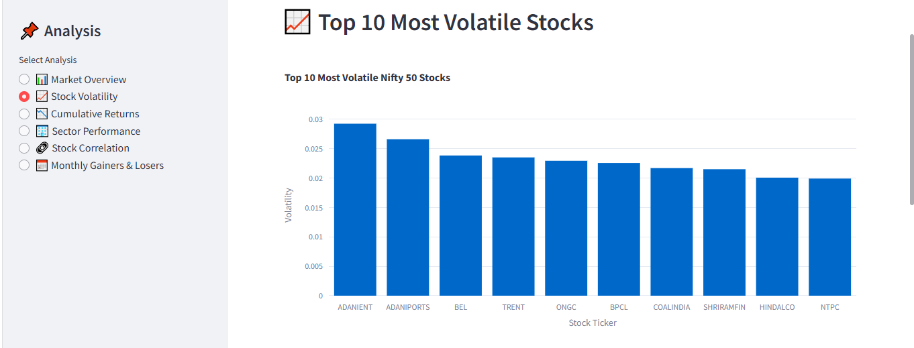
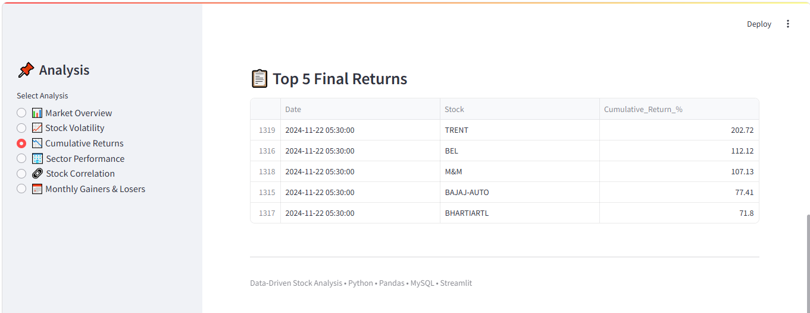
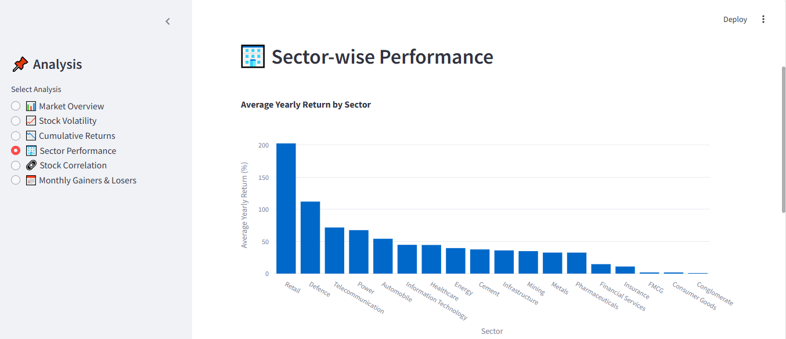
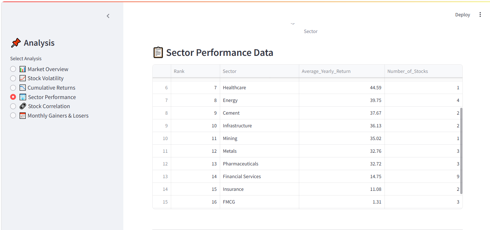
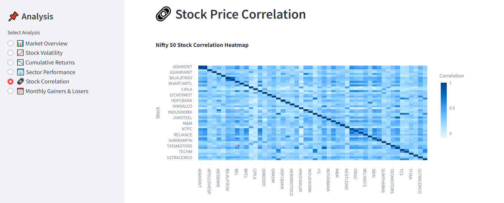
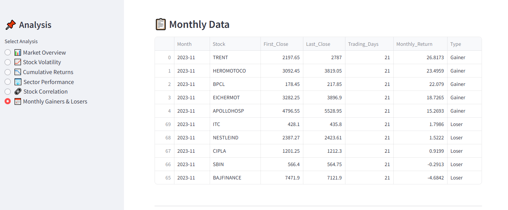
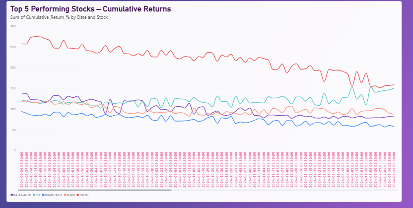
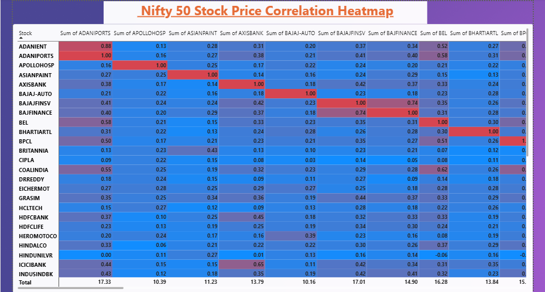

# Data-Driven Stock Analysis

## Organizing, Cleaning, and Visualizing Market Trends

## Project Overview

**Data-Driven Stock Analysis** is a data analytics project focused on analyzing historical NIFTY 50 stock market data from November 2023 to November 2024.

The project uses Python, Pandas, SQL, Streamlit, and Power BI to extract, clean, transform, analyze, and visualize stock market data.

The project provides insights into stock returns, market performance, volatility, cumulative returns, sector-wise performance, stock correlations, and monthly gainers and losers.

Two dashboards are developed as part of this project:

* Streamlit Dashboard – Python-based interactive dashboard.
* Power BI Dashboard – Interactive business intelligence visualizations.

---

## Objectives

* Analyze historical NIFTY 50 stock market data.
* Extract and clean raw YAML data.
* Convert YAML data into structured CSV datasets.
* Store processed stock data in a MySQL database.
* Identify the top 10 performing and underperforming stocks.
* Calculate market summary statistics.
* Analyze stock volatility and cumulative returns.
* Analyze sector-wise performance.
* Calculate stock price correlations.
* Identify monthly top gainers and losers.
* Develop interactive dashboards using Streamlit and Power BI.

---

## Technologies Used

| Category              | Technologies        |
| --------------------- | ------------------- |
| Programming           | Python              |
| Data Analysis         | Pandas, NumPy       |
| Visualization         | Matplotlib, Seaborn |
| Machine Learning      | Scikit-learn        |
| Data Extraction       | PyYAML              |
| Database              | MySQL               |
| Database Connectivity | SQLAlchemy, PyMySQL |
| Dashboard             | Streamlit, Power BI |
| Version Control       | Git, GitHub         |

---

## Dataset

The project uses historical market data for 50 NIFTY 50 stocks.

**Data Period:** November 2023 to November 2024

### Data Fields

* Date
* Ticker
* Open
* High
* Low
* Close
* Volume
* Month

The dataset is used to calculate stock returns, volatility, cumulative performance, monthly returns, and sector-wise performance.

---

## Project Workflow

```text
Raw YAML Data
      |
      v
Data Extraction
      |
      v
Data Cleaning and Transformation
      |
      v
CSV Datasets
      |
      v
MySQL Database
      |
      v
Data Analysis
      |
      +-----------------------+
      |                       |
      v                       v
Streamlit Dashboard      Power BI Dashboard
      |                       |
      v                       v
Interactive Analysis     Business Intelligence
```

---

## Key Analysis

### 1. Top 10 Gainers

Identifies the top 10 NIFTY 50 stocks based on yearly returns.

### 2. Top 10 Losers

Identifies the 10 stocks with the lowest yearly returns.

### 3. Market Summary

Provides an overview of market performance using:

* Total number of stocks
* Number of green stocks
* Number of red stocks
* Average closing price
* Average trading volume

### 4. Volatility Analysis

Calculates daily returns and standard deviation to identify stocks with higher price fluctuations.

Daily return is calculated using:

```text
Daily Return = (Current Close - Previous Close) / Previous Close
```

### 5. Cumulative Returns

Calculates cumulative returns to analyze stock performance over time and identify top-performing stocks.

### 6. Sector-wise Performance

Maps NIFTY 50 stocks to their respective sectors and calculates average yearly returns for each sector.

### 7. Stock Correlation

Calculates correlations between stock prices using Pandas and visualizes the relationships through a correlation heatmap.

### 8. Monthly Gainers and Losers

Identifies the top 5 gainers and top 5 losers for each month during the analysis period.

---

# Dashboards

## 1. Streamlit Dashboard

The Streamlit dashboard provides interactive analysis of NIFTY 50 stock market data.

### Dashboard Features

* Market Overview
* Stock Volatility
* Cumulative Returns
* Sector Performance
* Stock Price Correlation
* Monthly Gainers and Losers

### Streamlit Dashboard Screenshots

#### Overall Dashboard



#### Market Overview



#### Stock Volatility




#### Cumulative Returns




#### Sector Performance





#### Stock Correlation




#### Monthly Gainers and Losers




---

## 2. Power BI Dashboard

Power BI is used to create interactive visualizations for exploring stock market performance, returns, volatility, and sector-wise trends.

### 1. Cumulative Returns

Visualizes the cumulative returns of stocks over the selected analysis period.



### 2. Monthly Gainers and Losers

Displays monthly stock performance and identifies gainers and losers.


### 3. Sector Performance

Analyzes average yearly returns across different sectors.


### 4. Stock Correlation

Visualizes correlations between NIFTY 50 stocks.



### 5. Stock Volatility

Displays stock volatility and helps analyze variations in daily returns.


---

## Project Structure

```text
Data-Driven-Stock-Analysis/
│
├── app.py
├── query
├── .gitignore
├── README.md
│
├── data/
│   └── csv_files/
│       ├── nifty_50/
│       ├── monthly_charts/
│       ├── market_summary.csv
│       ├── monthly_gainers_losers.csv
│       ├── sector_performance.csv
│       ├── stock_correlation.csv
│       ├── stock_return.csv
│       ├── stock_returns.csv
│       ├── stock_volatility.csv
│       ├── top_10_gainers.csv
│       ├── top_10_losers.csv
│       ├── top_10_volatility.csv
│       └── top_5_cumulative_returns.csv
│
├── scripts/
│   ├── 01_read_companies.py
│   ├── 01_yaml_to_csv.py
│   ├── 02_read_csv.py
│   ├── 02_store_to_sql.py
│   ├── 03_calculate_returns.py
│   ├── 03_market_analytics.py
│   ├── 04_moving_average.py
│   ├── 05_volatility.py
│   ├── 06_stock_summary.py
│   ├── 07_read_nifty.py
│   ├── 07_top_stocks.py
│   ├── 08_top_gainers_losers.py
│   ├── 09_market_summary.py
│   ├── 10_top_volatility.py
│   ├── 11_cumulative_return.py
│   ├── 12_sector_performance.py
│   ├── 13_stock_correlation.py
│   ├── 14_market_visualization.py
│   ├── 15_monthly_gainers_losers.py
│   ├── 16_monthly_gainers_losers_visualization.py
│   ├── 16_split_by_symbol.py
│   ├── 17_volatility_standard.py
│   └── 18_stock_return.py
│
└── yaml_files/
    └── Monthly stock data
```

---

## Database

The processed stock market data is stored in MySQL.

| Component             | Details             |
| --------------------- | ------------------- |
| Database              | `stock_analysis`    |
| Main Table            | `stocks`            |
| Database Connectivity | SQLAlchemy, PyMySQL |

SQL is used to store, query, and retrieve processed stock market data for analysis and dashboard development.

---

## Installation

Install Python and the required libraries.

```bash
pip install pandas numpy matplotlib seaborn scikit-learn pyyaml streamlit sqlalchemy pymysql
```

Make sure MySQL is installed and configured if you want to use the database functionality.

---

## Running the Project

### Step 1: Clone the Repository

```bash
git clone https://github.com/arthi-564219/Data-Driven-Stock-Analysis.git
```

### Step 2: Navigate to the Project Directory

```bash
cd Data-Driven-Stock-Analysis
```

### Step 3: Run the Streamlit Application

```bash
streamlit run app.py
```

The Streamlit application will open in your browser.

---

## Key Project Outputs

The project generates datasets and visualizations for:

* Top 10 Gainers
* Top 10 Losers
* Market Summary
* Top 10 Volatility
* Cumulative Returns
* Sector Performance
* Stock Correlation
* Monthly Gainers and Losers
* Stock Returns
* Stock Volatility

---

## Project Results

The following results summarize the market analysis for the selected dataset and analysis period.

### Market Summary

| Metric                  |       Result |
| ----------------------- | -----------: |
| Total Stocks            |           50 |
| Green Stocks            |           38 |
| Red Stocks              |           12 |
| Green Stocks Percentage |          76% |
| Red Stocks Percentage   |          24% |
| Average Closing Price   |      2230.16 |
| Average Trading Volume  | 7,250,021.43 |

### Top Gainers

The top-performing stocks based on yearly returns include:

| Rank | Stock      |
| ---- | ---------- |
| 1    | ADANIPORTS |
| 2    | BPCL       |
| 3    | ONGC       |
| 4    | TRENT      |
| 5    | ADANIENT   |

The volatility analysis identifies stocks with higher variation in daily returns and helps understand price movements and market risk.

---

## Skills Demonstrated

* Data Collection and Extraction
* Data Cleaning and Transformation
* Exploratory Data Analysis
* Statistical Analysis
* Financial Data Analysis
* Data Visualization
* SQL Database Management
* Python Programming
* Dashboard Development
* Streamlit
* Power BI
* Git and GitHub

---

## Author

Aarthi R

B.Sc. Computer Science

GitHub: [Data-Driven-Stock-Analysis](https://github.com/arthi-564219/Data-Driven-Stock-Analysis)

---

## Disclaimer

This project is developed for educational and data analytics purposes. The analysis is based on historical stock market data and should not be considered financial or investment advice.

